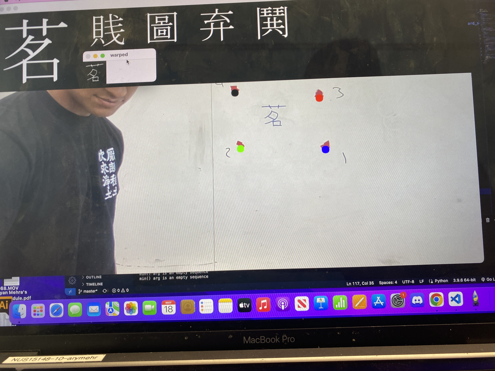

# Handwritten OCR for Kanji Characters

Open-source research project developing a CNN OCR (optical character recognition) dataset and model that can identify handwritten Kanji and other Japanese characters.




## Dataset
Dataset is located at `Machine_Learning/data`. Each file is a PNG of the character in its filename. The original SVG [dataset](https://github.com/KanjiVG/kanjivg/releases) that was processed contains 7,000 images of handwritten kanji characters.


## OCR Model

Model architecture is located at `Machine_Learning/architecture.py`. To import the model and weights in PyTorch run the following inside this cloned repo.

```python
import torch
from Machine_Learning.architecture import KanjiNet

model = KanjiNet()
model.load_state_dict(torch.load('Machine_Learning/weights.pth')
```


## Next Steps and Contributing

If you have improvements for data processing, training, or architecture please feel free to submit a pull request, any changes are welcome!

Next steps:
- [ ] Add segmentation and RNN to model for multi-character prediction

## License

The **Kanji-OCR** project is open-source and is licensed under the [MIT License](https://github.com/Jdka1/Kanji-Recognition/blob/main/LICENSE).
